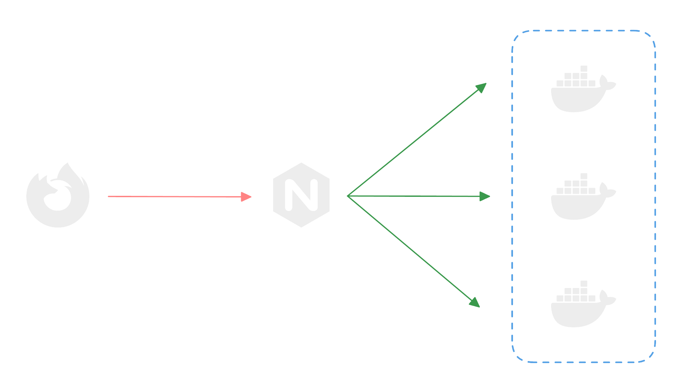

# Nginx Load  Balancer

This is a simple Nginx load balancer that runs against 3 Docker containers. Each container runs a simple [Hono.js](https://hono.dev) server on port `3000`, while Docker compose is used to map these ports to `3001`, `3002` and `3003`. This load balancer is deployed on Oracle Cloud using Terraform to provision a VM and Ansible to configure the VM.




## Technologies Used

- Nginx
- Docker
- Docker Compose
- Hono JS
- Terraform [view source](https://github.com/anav5704/learning-terraform)
- Ansible [view source](https://github.com/anav5704/learning-ansible)

## Getting Started

Make sure you have [Nginx](https://nginx.org) and [Docker](https://docker.com) installed on your machine. 

### Build and Start Containers


First, build and start the containers using `docker-compose`:

```sh
docker-compose up --build -d
```

### Configure Nginx

Next, you need to replace the default `nginx.conf` on your machine with the one provided in this [here](https://github.com/anav5704/learning-ansible/blob/main/config/nginx.conf). This file should be located at `C:/nginx/conf/nginx.conf` on Windows and `/etc/nginx/nginx.conf` on MacOS. 


Then, start up Nginx on Windows using:

```sh
cd path/to/nginx
```

```sh
nginx.exe
```

Or this if you're on a Mac:

```sh
sudo nginx
```

### Access Load Balancer

Finally, open your browser and go to `http://localhost:8080` to see the response. Each time you refresh, the server that sends the response will change.

## Learning Resources

- [What is Nginx?](https://youtu.be/iInUBOVeBCc?si=HgCJSpQSdJ7u2gEP)
- [Nginx with Docker](https://youtu.be/q8OleYuqntY?si=xjgTwVrMyM8DginP)
- [Docker crash course](https://youtu.be/pg19Z8LL06w?si=7v0qYUgNuhGS1wmn)